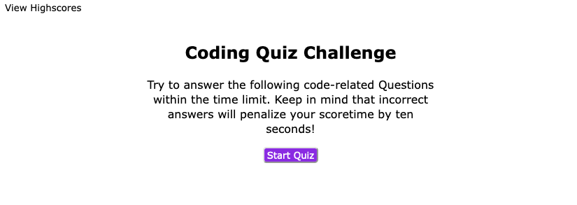
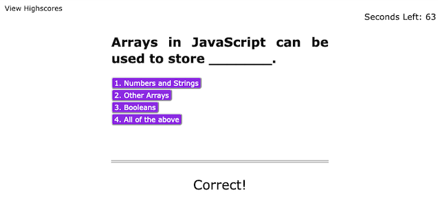
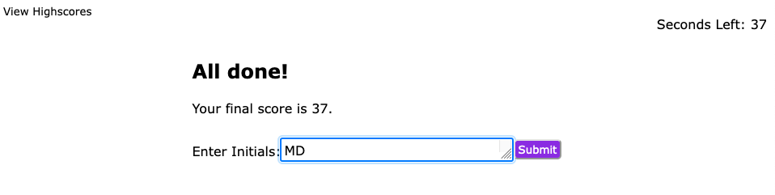
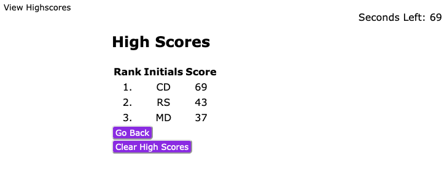

# code-quiz
## Description

Developed a Coding Quiz to display the skills I have developed with HTML, CSS, JavaScript and Web APIs. As my skills increase through the coding bootcamp, I will begin to apply to Developer positions. Since I will be required to complete quizzes like the one I built, I was able to develop first hand knowledge of what goes into building these quizzes. 

By developing all of the code from scratch, I was able to demonstrate what I have learned throughout the Carleton University Full Stack Coding Bootcamp as well as be resourceful to research bugs that come up along the way. 

## Installation

n/a

## Usage

You can visit [my deployed site here](https://mdeluca13.github.io/code-quiz/).

1. When you click on the Start Quiz Button, you will be prompted with your first quiz question and start the 75 second timer that will display in the top right corner of the page. 
2. When you click on your answer, it will bring you to the next question and prompt whether your answer was Correct or Incorrect. 
3. If you are incorrect, you will be deducted 10 seconds on the timer. Once you answer all 5 questions, you will be brought to the Quiz End Page where you will be presented with your score and a text box to enter your initials for the high score board. 
4. Once you click submit, you will be brought to the High Score Board where you can see the top 5 high scores with their initials. 
5. From the High Score Page, you can either return to the home page to try the quiz again through the Go Back button or you can clear the scoreboard by clicking Clear High Scores. 
6. You can visit the High Score Board at any point by clicking the High Score Button in the top left corner of the page. 

## Credits

n/a

## License

The License used was the [MIT License](https://choosealicense.com/licenses/mit/). Also found in repository under LICENSE.